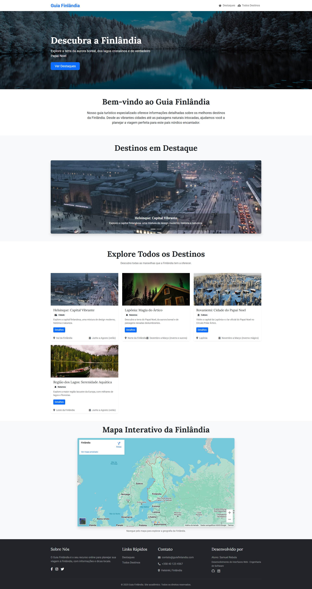
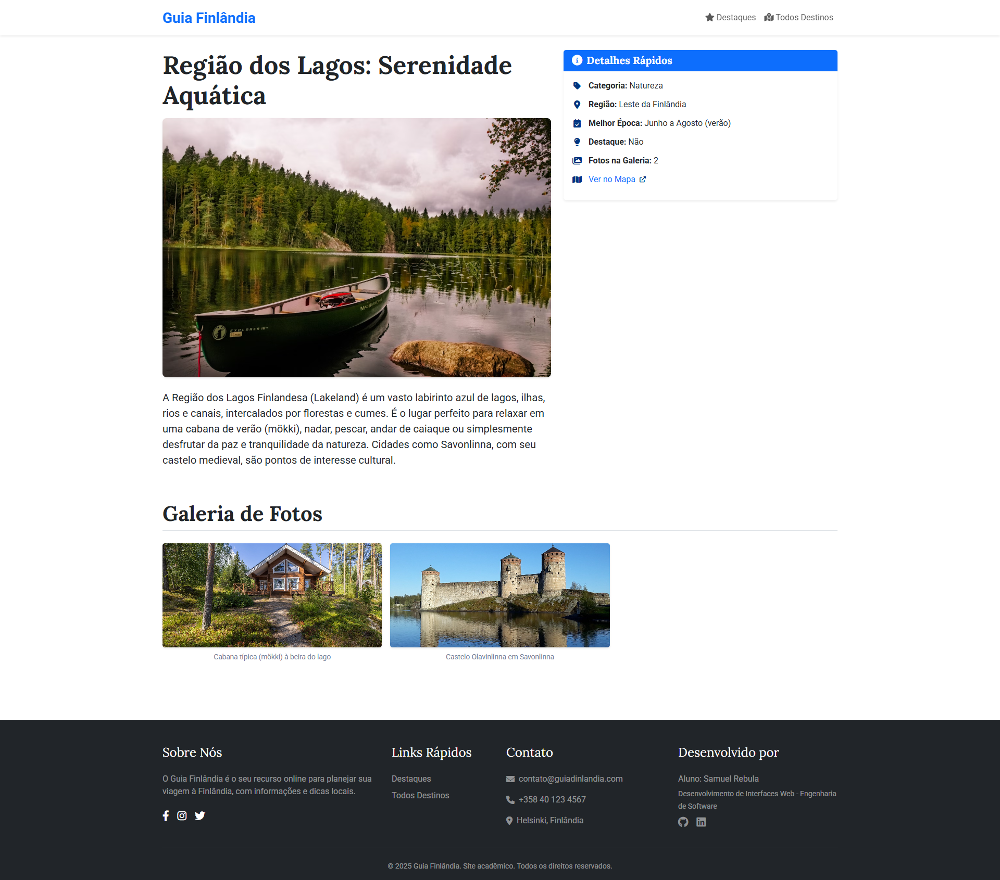

## Informações Gerais

- Proposta de projeto escolhida: Guia de Lugares Turísticos
- Breve descrição sobre seu projeto: O "Guia Finlândia" é dedicado a apresentar os destinos turísticos da Finlândia. O projeto oferece informações sobre os locais, com imagens, descrições e um mapa interativo.

## Print da Homepage

## Print dá Página detalhe

